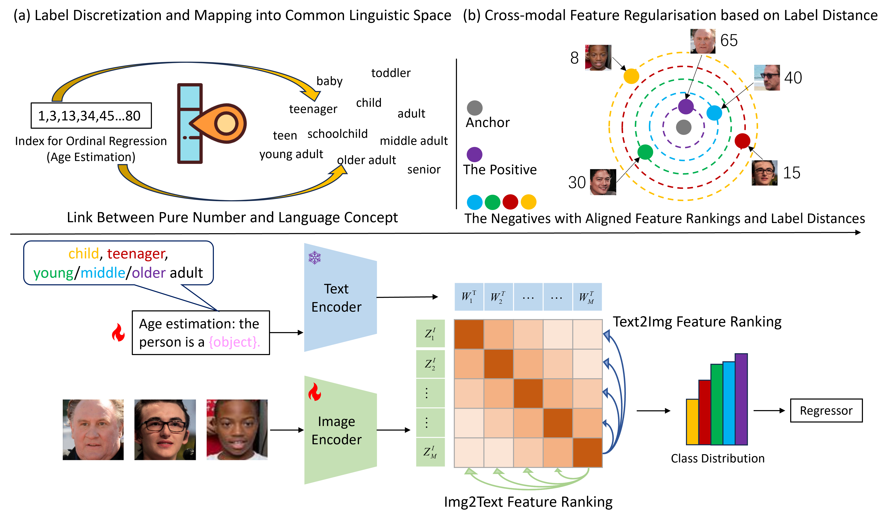

# NumCLIP

This repository contains PyTorch implementation of "Teach CLIP to Develop a Number Sense for Ordinal Regression (ECCV2024)".

Created by [Du Yao](https://scholar.google.com.hk/citations?user=8krbrWsAAAAJ&hl=zh-CN), [Zhai Qiang](https://scholar.google.com.hk/citations?hl=zh-CN&user=3I5VuhUAAAAJ), [Dai Weihang](https://scholar.google.com.hk/citations?hl=zh-CN&user=4iTfHyQAAAAJ), [Li Xiaomeng](https://xmengli.github.io/)\*

## Overview of NumCLIP

The framework of NumCLIP, aiming to teach CLIP to develop a strong number sense for ordinal regression. 

Replacing pure numbers as common language descriptions allow better utilising the pre-training knowledge, and cross-modal ranking-based feature regularisation ensures both semantic and ordinal alignment.



## Quick Preview

### Img2Lang Concept
NumCLIP mimics human numerical cognition: mapping an image feature to a language concept first, and then reasoning the number.
<p align="center">
     <br>

This paradigm can be condcuted in a coarse-to-fine manner. From that we elegantly convert an dense regression task into a simple and coarse classification problem, which not only smoothly mitigates the insufficient number caption issue, but also effectively utilises/recalls the pre-trained/available concept alignment learned by CLIP.

### Cross-modal Ranking-based Feature Regularization
The cross-modal negative samples are pushed away with ordinal label distance alignment.
```python
    def compute_ce_dis_loss(self,logits,y,d):

        list_target = list(range(d))
        target = torch.Tensor(list_target).to('cuda:0')
        target = torch.unsqueeze(target,1)
        ls_weight = []
        for i in range(len(y)):
            label_inv_ranks = (torch.abs(y[i] - target).transpose(0,1))
            label_inv_ranks_norm = (torch.abs(y[i] - target).transpose(0,1)) / torch.sum(label_inv_ranks,dim=1) * (d-1)
            label_inv_ranks_norm = torch.squeeze(label_inv_ranks_norm,0)
            label_inv_ranks_norm[y[i]] = 1.0
            ls_label_inv_ranks_norm = label_inv_ranks_norm.detach().cpu().numpy().tolist()
            ls_weight.append(ls_label_inv_ranks_norm)

        weight = torch.Tensor(ls_weight).to('cuda:0')

        logits_weight = logits * weight
        loss = self.ce_loss_func(logits_weight, y)

        return loss
```

## Requirements
We utilize the code base of [OrdinalCLIP](https://github.com/xk-huang/OrdinalCLIP). Please follow their instructions to prepare the environment and datasets.

## Model Training
Before training the model, move `regclipssr.py` to `./ordinalclip/models/`, and `runner_ssr.py` to `./ordinalclip/runner/` accordingly.

```bash
sh scripts/run_regclipssr.sh
```


## What's More
Check out these amazing works leveraging CLIP for number problems!

- [OrdinalCLIP: Learning Rank Prompts for Language-Guided Ordinal Regression (NeurIPS2022)](https://github.com/xk-huang/OrdinalCLIP)
- [DepthCLIP: Can Language Understand Depth? (ACM MM2022)](https://github.com/Adonis-galaxy/DepthCLIP?tab=readme-ov-file#depthclip-can-language-understand-depth)
- [CrowdCLIP: Unsupervised Crowd Counting via Vision-Language Model (CVPR2023)](https://github.com/dk-liang/CrowdCLIP)
- [L2RCLIP: Learning-to-Rank Meets Language: Boosting Language-Driven Ordering Alignment for Ordinal Classification (NeurIPS2023)](https://github.com/raywang335/L2RCLIP)
- [Teach CLIP to Count to Ten (ICCV2023)](https://teaching-clip-to-count.github.io/)


## Citation
If you find this codebase helpful, please consider to cite:

```
@article{du2024teach,
  title={Teach CLIP to Develop a Number Sense for Ordinal Regression},
  author={Du, Yao and Zhai, Qiang and Dai, Weihang and Li, Xiaomeng},
  journal={arXiv preprint arXiv:2408.03574},
  year={2024}
}
```
